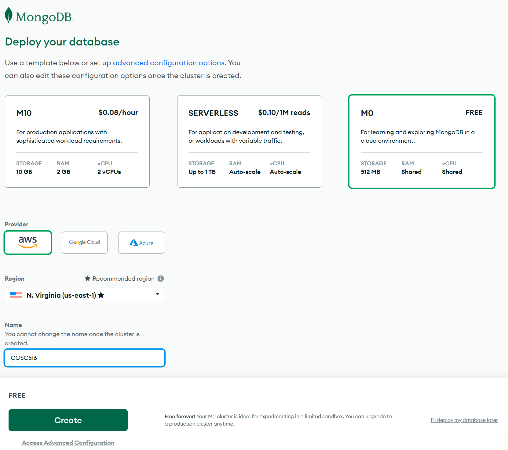
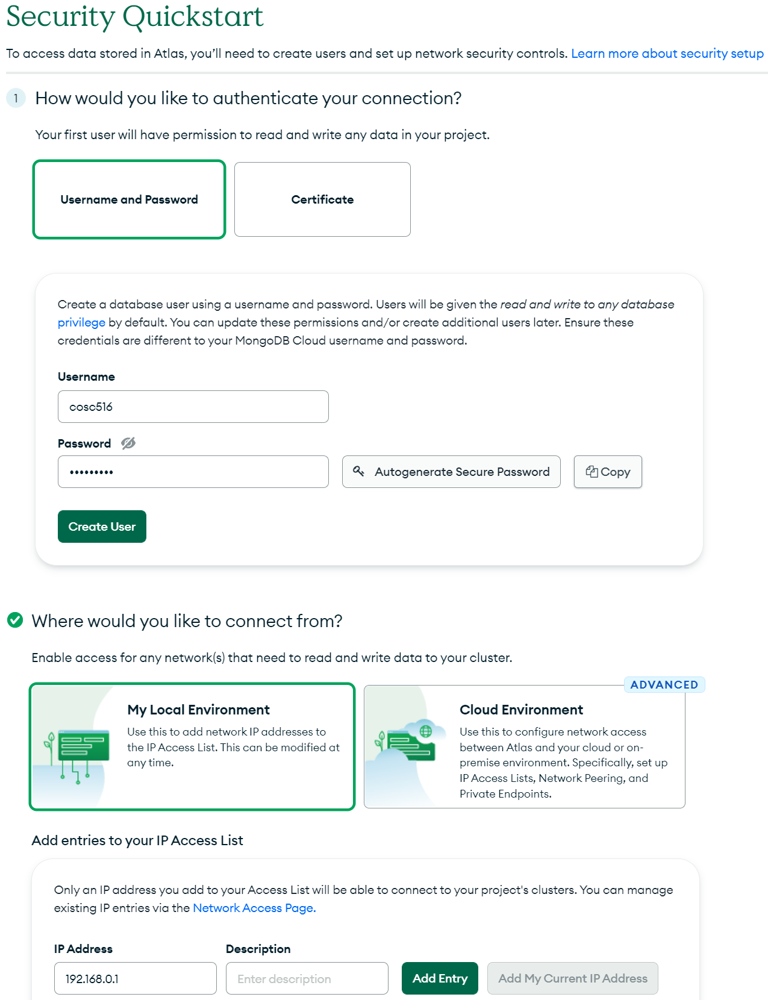
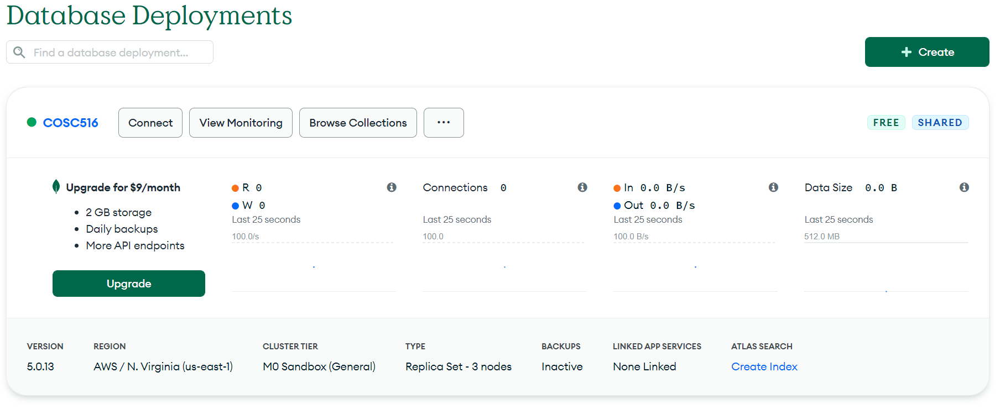
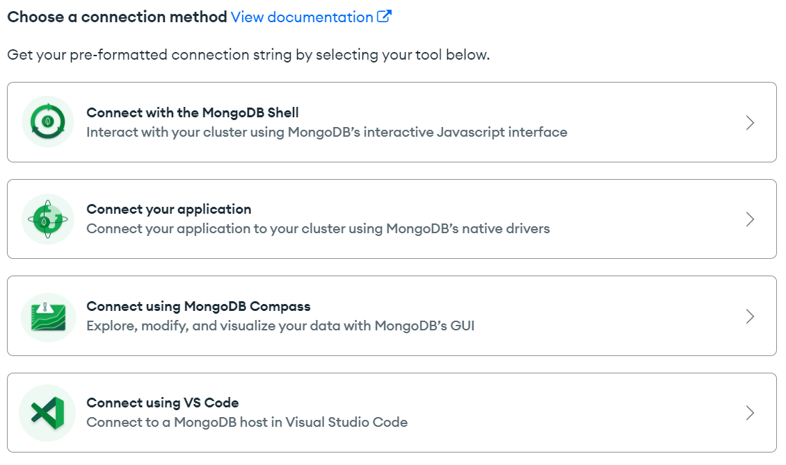
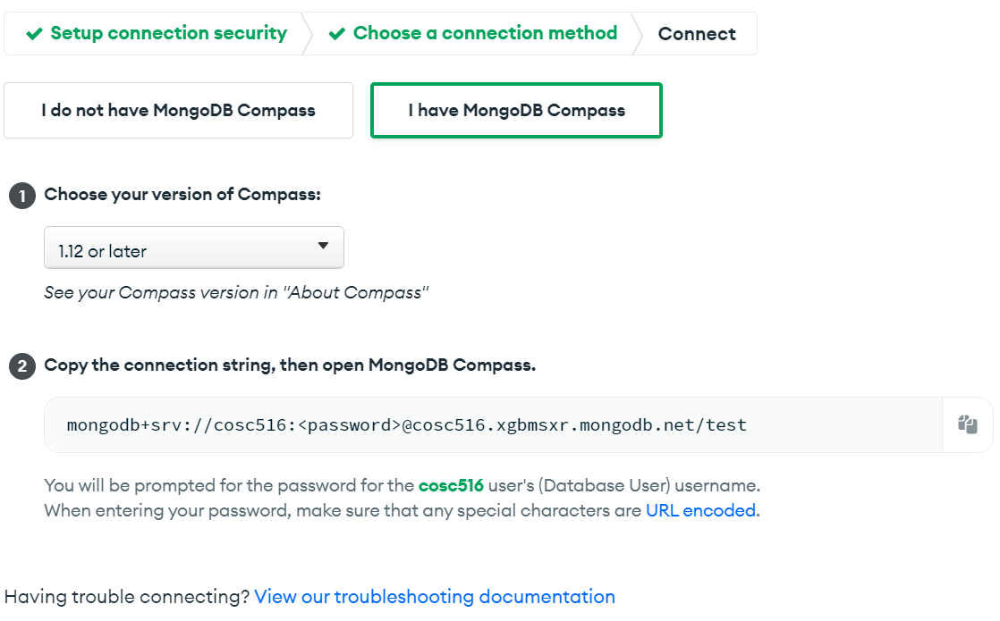
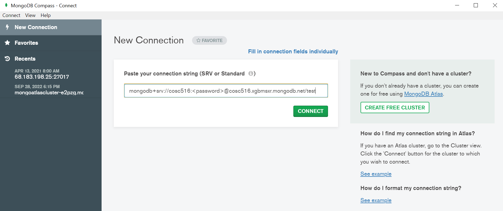

# COSC 516 - Cloud Databases Lab 4 - MongoDB Atlas

## Setup

Create a MongoDB Atlas account at: [https://www.mongodb.com/cloud/atlas/register](https://www.mongodb.com/cloud/atlas/register)  [Tutorial](https://www.mongodb.com/docs/atlas/tutorial/deploy-free-tier-cluster/).

MongoDB Atlas supports a free cluster with up to 512 MB storage. No credit card is required.

## Create a Free M0 Cluster

Login to Atlas. Create a free M0 cluster. Provide a cluster name.

## Specify Authentication

Create a database user account with a password. Add your IP address to allow access to the cluster from your machine. 

On the dashboard, there is information about the cluster. To get connection information, click on  `Connect` button. 

## Connecting to the Cluster

Connecting to MongoDB cluster can be done using MongoDB shell, Mongo Compass application, or using a language library.

### Connecting using MongoDB Compass

MongoDB Compass is a graphical query tool that runs on all major platforms. You can download and install it directly from the connection screen shown previously.To connect, provide the connection string for the cluster. It is possible to insert, query, and browse data.

### Accessing using Client Library

The lab will use the Java client library. An example code file called `SampleBigtable.java` is in the lab. This sample creates a table, writes data, reads data, then deletes the table. There is [more information on this "Hello world" example](https://cloud.google.com/bigtable/docs/samples-java-hello-world).

For setup, follow [these instructions](https://cloud.google.com/docs/authentication/provide-credentials-adc).

You will need to install the Google Cloud CLI then run the command: `gcloud auth application-default login`.

## Tasks

To test your database, write Java code using VS Code. The file to edit is `Bigtable.java`.  The test file is `TestBigtable.java`.  Fill in the methods requested (search for **TODO**).  Marks for each method are below.  You receive the marks if you pass the JUnit tests AND have followed the requirements asked in the question (including documentation and proper formatting).

- +1 mark - Write the method `connect()` to create a connection. Create a Bigtable data client and admin client. See [SampleBigtable.java](SampleBigtable.java) for starter code.
- +1 mark - Write the method `createTable()` to create a table to store the sensor data.
- +5 marks - Write the method `load()` to load the sensor data into the database. The data files are in the [data](src/data) folder. 
- +3 marks - Write the method `query1()` that returns the temperature at Vancouver on 2022-10-01 at 10 a.m.
- +3 marks - Write the method `query2()` that returns the highest wind speed in the month of September 2022 in Portland.
- +3 marks - Write the method `query3()` that returns all the readings for SeaTac for October 2, 2022.
- +4 marks - Write the method `query4()` that returns the highest temperature at any station in the summer months of 2022 (July (7), August (8)).

**Total Marks: 20**

## Bonus Marks: (up to 2)

Up to +2 bonus marks for demonstrating some other feature of Google Cloud Bigtable or writing your own unique query and test case.

## Submission

The lab can be marked immediately by the professor or TA by showing the output of the JUnit tests and by a quick code review.  Otherwise, submit the URL of your GitHub repository on Canvas. **Make sure to commit and push your updates to GitHub.**

