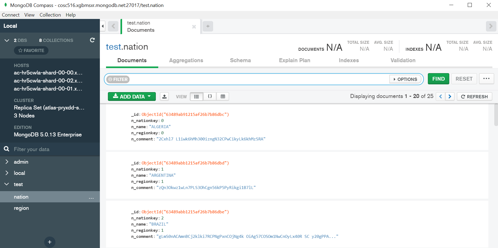

# COSC 516 - Cloud Databases Lab 4 - MongoDB Atlas

## Setup

Create a MongoDB Atlas account at: [https://www.mongodb.com/cloud/atlas/register](https://www.mongodb.com/cloud/atlas/register).  There is a [tutorial](https://www.mongodb.com/docs/atlas/tutorial/deploy-free-tier-cluster/).

MongoDB Atlas supports a free cluster with up to 512 MB storage. No credit card is required.

## Create a Free M0 Cluster

Login to Atlas. Create a free M0 cluster. Provide a cluster name.

## Specify Authentication

Create a database user account with a password. Add your IP address to allow access to the cluster from your machine. 

On the dashboard, there is information about the cluster. To get connection information, click on  `Connect` button. 

## Connecting to the Cluster

Connecting to MongoDB cluster can be done using MongoDB shell, MongoDB Compass application, or using a language library.

### Connecting using MongoDB Compass

MongoDB Compass is a graphical query tool that runs on all major platforms. You can download and install it directly from the connection screen shown previously.To connect, provide the connection string for the cluster. It is possible to insert, query, and browse data.

### Accessing using Client Library

The lab will use the Java client library. An example code file called `SampleMongo.java` is in the lab. <!-- This sample creates a table, writes data, reads data, then deletes the table. There is [more information on this "Hello world" example](https://cloud.google.com/bigtable/docs/samples-java-hello-world). -->

### References

- [MongoDB Introduction](https://docs.mongodb.org/manual/core/introduction/)
- [Creating a Collection](https://docs.mongodb.org/manual/reference/method/db.createCollection/)
- [Modifying Documents](https://docs.mongodb.org/manual/tutorial/modify-documents/)
- [Querying using find()](https://docs.mongodb.org/manual/reference/method/db.collection.find/)
- [Mongo Java Driver API](https://mongodb.github.io/mongo-java-driver/4.4/apidocs/mongodb-driver-core/com/mongodb/package-summary.html)

## Tasks

To test your database, write Java code using VS Code. The file to edit is `MongoDB.java`.  The test file is `TestMongoDB.java`.  Fill in the methods requested (search for **TODO**).  Marks for each method are below.  You receive the marks if you pass the JUnit tests AND have followed the requirements asked in the question (including documentation and proper formatting).

- +2 marks - Write the method `load()` to load the TPC-H `customer` and `orders` data into separate collections (like how it would be stored in a relational model). The data files are in the [data](src/data) folder. 
- +3 marks - Write the method `loadNest()` to load the TPC-H customer and order data into a nested collection called `custorders` where each document contains the customer information and all orders for that customer.
- +1 marks - Write the method `query1()` that returns the customer name given a customer id using the `customer` collection.
- +2 marks - Write the method `query2()` that returns the order date for a given order id using the `orders` collection.
- +2 marks - Write the method `query2Nest()` that returns order date for a given order id using the `custorders` collection.
- +2 marks - Write the method `query3()` that returns the total number of orders using the `orders` collection.
- +2 marks - Write the method `query3Nest()` that returns the total number of orders using the `custorders` collection.
- +3 marks - Write the method `query4()` that returns the top 5 customers based on total order amount using the `customer` and `orders` collections.
- +3 marks - Write the method `query4Nest()` that returns the top 5 customers based on total order amount using the `custorders` collection.

**Total Marks: 20**

## Bonus Marks: (up to 2)

Up to +2 bonus marks for demonstrating some other feature of MongoDB Atlas.

## Submission

The lab can be marked immediately by the professor or TA by showing the output of the JUnit tests and by a quick code review.  Otherwise, submit the URL of your GitHub repository on Canvas. **Make sure to commit and push your updates to GitHub.**

